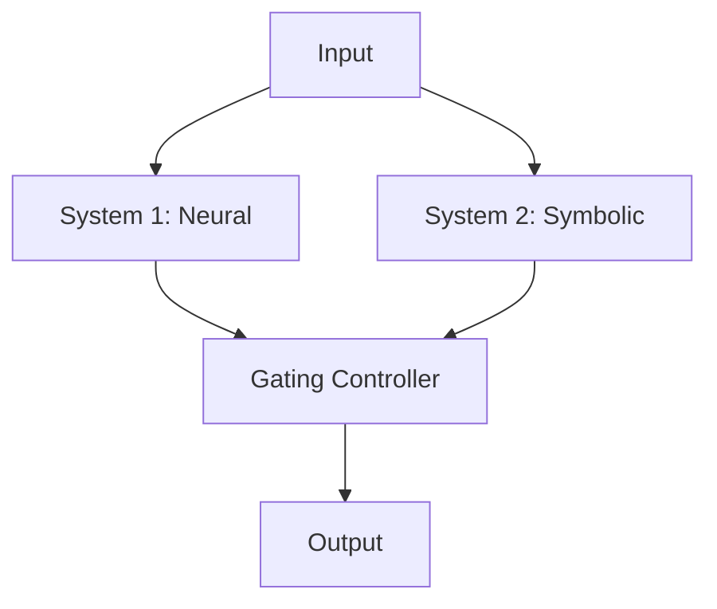
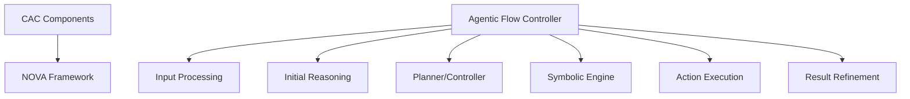

# CAC Agent Architecture

## Overview

The Cohen's Agentic Conjecture (CAC) agent implementation combines NOVA's agent framework with dual-process cognitive architecture. This document outlines the high-level architecture and component interactions.

## Core Components

### 1. Dual-Process System



#### System 1 (Neural Subsystem)
- Fast, intuitive processing
- Pattern recognition
- Implemented using neural networks
- Confidence scoring mechanism

#### System 2 (Symbolic Subsystem)
- Slow, deliberative processing
- Rule-based reasoning
- Knowledge graph integration
- Logical validation

#### Gating Controller
- Dynamic threshold management
- Subsystem coordination
- Performance monitoring
- Feedback integration

### 2. NOVA Integration Points



#### Agentic Flow Mapping
- Input Processing → System 1 initial processing
- Initial Reasoning → System 1 pattern recognition
- Planner/Controller → Gating Controller
- Symbolic Engine → System 2 processing
- Action Execution → Combined system output
- Result Refinement → Feedback loop

### 3. Component Interactions

#### Data Flow
1. Input Reception
   - Raw input processing
   - LASER embedding generation
   - Context preparation

2. Parallel Processing
   - System 1: Neural network processing
   - System 2: Symbolic reasoning
   - Confidence calculation

3. Gating Decision
   - Threshold evaluation
   - System selection/combination
   - Output generation

4. Feedback Loop
   - Performance monitoring
   - Rule refinement
   - Neural retraining

## Implementation Strategy

### 1. Core Classes

```python
class CACAgent:
    def __init__(self):
        self.system1 = NeuralSubsystem()
        self.system2 = SymbolicSubsystem()
        self.gating = GatingController()
        
    async def process(self, input_data):
        # Implementation
        pass
```

### 2. Configuration Structure

```yaml
cac_agent:
  neural_system:
    model: "default"
    confidence_threshold: 0.75
    
  symbolic_system:
    rules_path: "config/rules.yaml"
    knowledge_graph: "config/knowledge.yaml"
    
  gating:
    default_threshold: 0.75
    adaptation_rate: 0.1
```

## Directory Structure

```
conjecture/
├── __init__.py
├── agent.py
├── config/
│   ├── agents.yaml
│   ├── rules.yaml
│   └── knowledge.yaml
├── core/
│   ├── neural.py
│   ├── symbolic.py
│   └── gating.py
└── tools/
    └── custom_tools.py
```

## Next Steps

1. [Implementation Plan](implementation_plan.md)
2. [Configuration Guide](configuration.md)
3. [Testing Strategy](testing.md)
4. [Integration Guide](integration.md)
